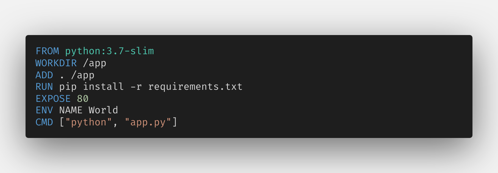
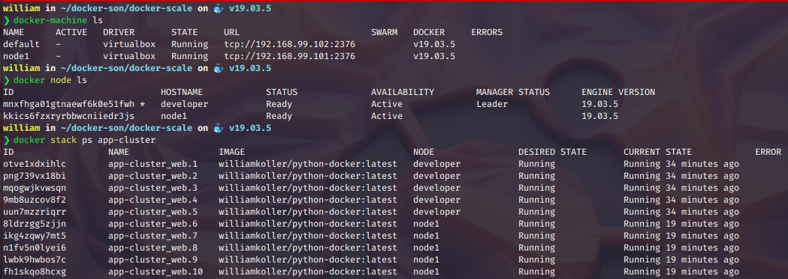
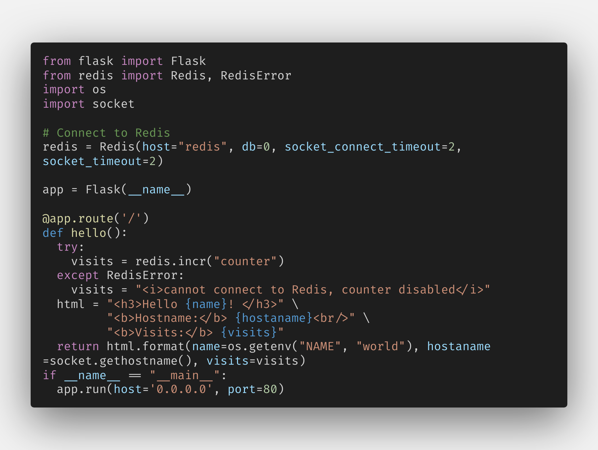
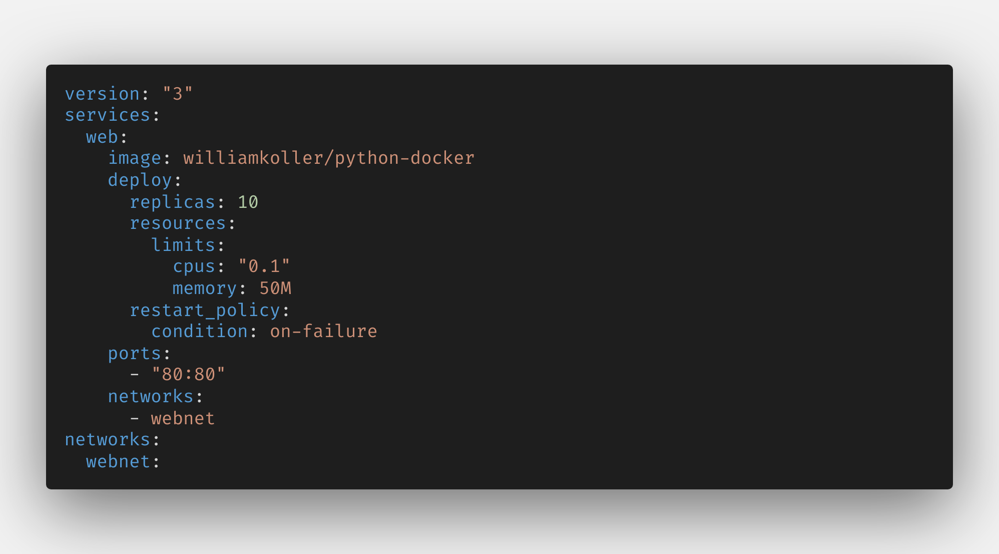

# Docker w/ Swarm 

- Working with cluster and using 10 replicates of the williamkoller / python-docker image downloaded from hob.docker.com

- Starting with two virtual machines with virtualbox

- Using Flask and Redis to connect to the cluster

- Using version: "3" from docker-compose.yml to use Swarm and configuring networks

